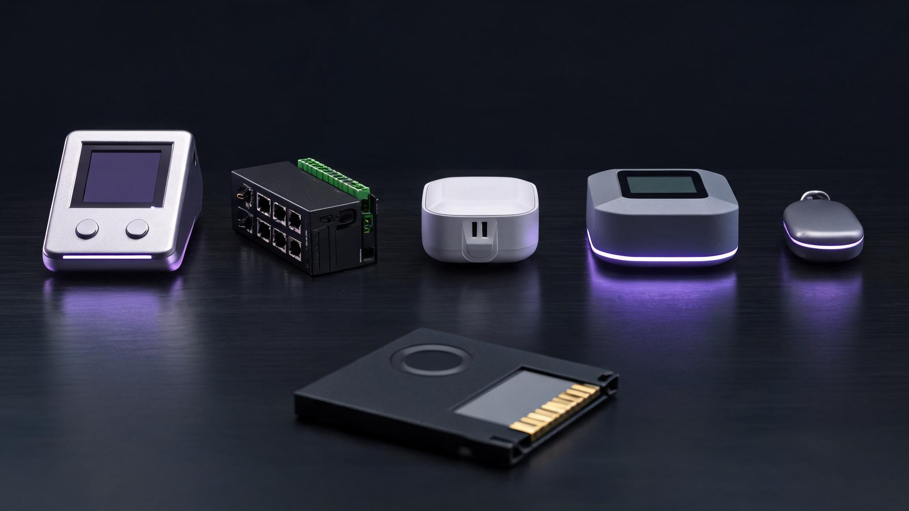
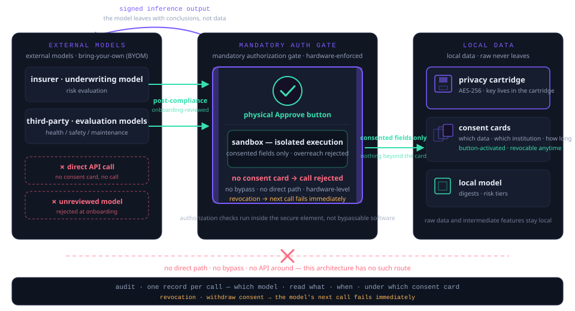

<div align="center">



# OpenWorker Deck

**给你的 AI 同事一个身体 · Give your AI coworker a body**

四大支柱：**智能链接**（MHS 原生，直连设备）· **本地模型**（个人隐私数据不出设备）· **检测** · **隐私存储**（可拔加密卡 · 计算存储分离），外加风险预测、SOS 急救提醒、气象计算、养老守护（健康数据对接 · 个人对照基线 · 机器人对接训练评估）、无屏守护吊牌、医疗设施监控与保险全链路 —— 以及一块 TRAE 式的桌面 Agent 面板。它同时是一台**工业网关 + 无线网关**：Modbus（RTU/TCP）· CAN/J1939 · OBD-II · BLE · LoRa，直连现场设备，无需集成商。软盘的形态，保险库的内核。

An open-source hardware companion for [OpenWorker](https://github.com/andrewyng/openworker) — TRAE-style agent visibility on a desk device, built on four pillars: **smart link** (MHS-native) · **local model** (personal private data computed on-device) · **detection** · **privacy storage** (removable encrypted cartridge, compute-storage separation) — with risk prediction, SOS alert, weather intelligence, elder care (BLE health-data pairing, personal-baseline comparison model, care-robot training & evaluation), the screenless guardian pendant, medical-facility monitoring and a privacy-computing insurance full chain on top. It talks to equipment **directly**: an industrial + wireless gateway speaking Modbus (RTU/TCP), CAN/J1939, OBD-II, BLE and LoRa. The floppy's form, the vault's soul.

[](https://modelhardwarestandard.com/)
[](https://github.com/andrewyng/openworker)
[]()

<sub>**Independent project · 非官方独立项目。** Not affiliated with, endorsed by, or sponsored by Andrew Ng, deeplearning.ai, or the [OpenWorker](https://github.com/andrewyng/openworker) project (MIT license, © 2024 Andrew Ng) — "OpenWorker" is used solely to indicate compatibility. 本项目与 OpenWorker 官方无隶属或背书关系，名称仅用于说明兼容性。</sub>

</div>

---

## English

### The problem

[OpenWorker](https://github.com/andrewyng/openworker) gave AI coworkers a place to live — your desktop, your data, your permissions. But your coworker has no way to **show you** what it's doing when you're looking elsewhere, and no way to **touch** the physical world it keeps notes about.

Meanwhile, the machines you rely on — the tractor, the HVAC, the clinic sterilizer, the compressor in your workshop — fail on their own schedule, and nobody notices until they break.

### The solution

**OpenWorker Deck** is one device that solves both:

| Pillar | What it does |
|---|---|
| **Agent console (TRAE-style)** | A 4″ screen that mirrors your coworker's live todo list and progress panel. When the agent needs permission — OpenWorker's `interactive` mode — it rings the desk: a physical card with **Approve / Deny** buttons. A status ring shows idle / thinking / needs-you. |
| **Smart link (MHS-native)** | Connects to equipment **directly** — Modbus RTU master (RS-485 multi-drop), Modbus TCP, CAN 2.0B/J1939, OBD-II, BLE 5.2 and LoRa — then registers itself and every bridged device on your network following the [Model Hardware Standard](https://modelhardwarestandard.com/) pattern: standard read/write interface, natural-language safety labels auto-generated. Any MHS-compatible agent (OpenWorker, Claude) discovers it instantly. |
| **Detection** | Four sensing modalities: vibration (3-axis accelerometer), thermal (IR thermopile), current signature (CT clamp), and acoustic (MEMS mic). Plus CAN 2.0B / RS-485 Modbus / OBD-II / BLE bridging into existing fault codes. |
| **Local model** | On-device NPU (0.5 TOPS) runs a **local model** — anomaly detection and small-model reasoning execute on the Deck itself. **Personal and private data are computed locally**: telemetry, logs and history never leave the device. Offline by default; the optional fleet bridge is opt-in and labeled. |
| **Privacy storage** | Your data used to have a shape you could hold. It does again: a **removable floppy-form encrypted disk** (3.5″ silhouette in armored metal, up to 512 GB). The key lives in the disk, not the machine. Pull it and your data physically leaves with you; the Deck keeps running on the 8 GB eMMC buffer and syncs the moment you re-insert. Pull-to-own: three seconds, no menus. |
| **Risk prediction** | Three risk classes per device, not just failure: **failure risk** (RUL curves — bearing wear, belt stretch, filter clog, refrigerant loss), **safety risk** (CO trends, thermal-runaway precursors, overload patterns — flagged early for human review), **compliance risk** (inspection and sensor-expiry deadlines). Output: a risk brief with likelihood, time window, recommended action, evidence — it informs decisions, never a safety system. |
| **SOS alert** | One long press: ring strobe + 90 dB piezo + an SOS card over MQTT (device location, last-minute telemetry) — LoRa long-range where there's no Wi-Fi, looping escalation until a guardian confirms. **Notification only — it never calls emergency services.** |
| **Weather intelligence** | On-board barometer and humidity feed the local model — pressure trend, dew point, frost probability, heat index computed on-device, no forecast subscription. Cross-read with the equipment registry turns weather into per-machine action lists (frost → pre-dawn irrigation advisory; heat wave → compressor derating). Official warnings stay with meteorological agencies — the Deck is the offline complement. |
| **Cold wallet (in the cartridge)** | The cartridge's secure element can hold keys that never touch a network: transactions are signed inside the cartridge, confirmed with the physical Approve button — one thumb, one signature. Self-custody by design; market-specific regulatory posture before shipping. |
| **Elder care** | BLE-standard health devices (blood pressure, glucose, SpO₂, weight, wearables) pair directly — no apps, no accounts — and the local model builds each elder's **personal baseline**. Evaluation is deviation from *their own* normal, never population thresholds; trend reminders go to family, anomalies escalate to SOS. Care robots join via MHS/MQTT and are scored against the same baseline; physical assistance requires the physical Approve button. **Monitoring and reminders — never diagnosis.** |
| **Guardian pendant (screenless)** | A screenless, nano-SIM (4G Cat.1bis) pendant for school kids, nursing-home elders, outdoor workers **and solo hikers**: calls preset contacts only, one-key SOS with location, guardian-loop confirmation, and triple positioning (GPS/WiFi/cellular) relaying to the family Deck — track history on the encrypted cartridge, **not a vendor cloud**. For the solo hiker: track breadcrumbs every 5 minutes, storm warning from the on-board barometer, and a check-in timer that auto-escalates if missed — last-known position and planned route already on the family Deck before signal is lost. Minor data under guardian consent and minimization (PIPL); SRRC approvals before mass production. |
| **Medical facilities (OR)** | In operating rooms and clinics the Deck monitors **equipment and environment only** — sterilizer cycles, anesthesia run-hours, temperature, humidity, pressure differential, HEPA lifetime — with a monthly audit-format facility report. Never patient-connected, never clinical; during surgery it is read-only, writes queue behind the physical button. |
| **Insurance full chain** | Privacy-computing infrastructure for personal insurance: the local model computes risk tiers from health baseline + equipment + environment; sharing happens through **granular, revocable consent cards** (activated by the physical button, every grant audited); a licensed insurer underwrites from verifiable digests; SOS evidence packages assemble themselves at claim time. **Private-model interconnect (post-compliance):** insurer and third-party proprietary models plug in sandboxed — *the model comes to the data, never the reverse* — reading only consented fields, leaving with signed inference outputs only, behind a **hardware-enforced mandatory authorization gate** (no consent card, no model call; no bypass, no direct API; revocation cuts access on the spot). The surgical chain evaluates *facility readiness* pre-op, records a signed read-only timeline intra-op, tracks equipment and environment post-op — and hands neutral records to arbitration bodies, never verdicts. **Not an insurance product — data preparation and consent infrastructure.** |

### The night-shift loop

```
your computer on:   OpenWorker ↔ Deck ↔ equipment   (live: agent reads, you approve)
your computer off: Deck → senses → stores          (night shift: local model watches, vault records)
cartridge pulled:  compute continues → eMMC        (history rides in your pocket)
you return:        Deck → buffered history → OpenWorker   ("while you were away...")
```

### Compute–storage separation

Not a floppy disk, not a black box — the compute plane and the storage plane are decoupled:

```
compute plane:  local model · NPU anomaly detection · MHS registry · protocol bridge   (always on)
storage plane:  hardware-encrypted cartridge · 8 GB eMMC buffer                         (swappable · yours)
private data:   computed by the local model, on the Deck                                (never uploaded by default)
cartridge out:  compute keeps running → eMMC buffer · history rides in your pocket
```

**The mandatory authorization gate** — the same separation applied to model calls. External models (insurer underwriting, third-party evaluation, reviewed at onboarding) run in a sandbox and may only read the fields a consent card declares; they leave with signed inference outputs, never raw data. No consent card, no call — no bypass, no direct API in the architecture, and a revocation cuts the model's next call immediately:

<p align="center">
  
</p>


| Separation buys | Why it matters |
|---|---|
| Privacy by physics | Pull the cartridge and the history physically leaves the machine — no remote wipe needed, no "trust us" |
| Local-model privacy | Personal and private data are computed by the on-device model — inference happens where the data lives, so nothing needs to be uploaded to be understood |
| Independent upgrade | Swap cartridge capacity without touching compute; compute firmware updates never rewrite the data layer |
| Failure isolation | A dead cartridge doesn't kill the sensor — edge detection continues, buffering to eMMC |
| Audit path | Hand the cartridge (not the machine) to an auditor — the compliance trail travels without the live sensor |

Pairs with the open-source [Hardware Repair Companion](https://github.com/andrewyng/openworker/pull/593) coworker: the Deck senses, the agent diagnoses — telemetry as evidence, manuals and parts pulled from public sources, maintenance logged per device.

### Direct device link — industrial gateway + wireless gateway in one

Legacy fieldbus on one side, MHS on the other. Every protocol below maps onto the same standard read/write interface with safety labels, so the agent never learns a vendor SDK.

| Link | How it connects | Typical equipment |
|---|---|---|
| **Modbus RTU** | RS-485 master, multi-drop bus (up to 32 devices, unit IDs 1–247) — reads holding/input registers and coils directly | VFDs, PLCs, energy meters, irrigation valves, center pivots |
| **Modbus TCP** | Ethernet / Wi-Fi client — same registers, no adapter hardware | Building management, power monitors, industrial PCs |
| **CAN 2.0B / J1939** | Direct bus tap at 250/500 kbit/s, PGN decoding | Tractors, harvesters, engines, implements |
| **OBD-II** | Via adapter cable — standard OBD PIDs | Generators, vehicles, compact tractors |
| **BLE 5.2** | Central role — GATT sensor profiles and vendor services | Cordless-tool batteries, BLE sensors and gauges |
| **LoRa 868/915 MHz** | Sub-GHz wireless gateway — field sensors at hundreds of meters to km range | Remote barns, pivots, tanks, greenhouses |
| **1-Wire** | Direct chain — digital temperature probes | Cold chains, boiler rooms |

### Northbound: the message gateway

Southbound speaks fieldbus to machines; northbound speaks MQTT to everything else — the same capability class Moxa's AIG series and USR's edge gateways ship, minus their cloud lock-in:

| Message layer | Capability | Talks to |
|---|---|---|
| **Built-in MQTT broker** (3.1.1 / 5.0) | Every bridged device mirrors onto a topic tree `deck/{device}/{register}` — telemetry publishes itself | Node-RED · Home Assistant · Grafana · SCADA |
| **MHS ↔ MQTT mapping** | The MHS device tree mirrors onto topics: agents subscribe instead of polling; write commands still pass the permission gate | Any MQTT-client agent, script or automation |
| **Cloud bridge** (opt-in) | TLS-bridged to your own broker — off by default, labeled when on | Azure IoT · AWS IoT · Alibaba Cloud · EMQX · self-hosted |
| **Offline buffering** | Messages land on the encrypted cartridge during outages, replay on reconnect (QoS 1 · store-and-forward) | Weak-network sites: barns, pump stations, mobile fleets |

No protocol island survives contact: the agent sees one MHS device tree, and the Deck translates underneath it. Devices with no digital interface at all fall back to the four contactless sensing modalities.

### Industrial design

Five form factors, one design language — matte graphite enclosures, functional color accents, fanless passive cooling. Storage is a floppy-form removable disk:

| Edition | Form factor | Role |
|---|---|---|
| **Desktop** | CNC anodized aluminum, 4″ console, USB-C powered, status ring | Sits next to you: todo/progress panel, physical Approve/Deny permission cards |
| **Industrial** | 35 mm DIN-rail, terminal blocks (RS-485/CAN), RJ45 (Modbus TCP), LoRa antenna, heatsink fins | Goes in the cabinet: wide-temperature, IP65 variant for the field |
| **Socket** | Smart-plug form factor, pass-through outlet, built-in current sensing — **and the ecosystem's smallest gateway base**: the MQTT broker runs in the socket, and sliding the privacy cartridge into its side slot turns it into a standalone privacy-compute storage node (night watch, track archive, SOS evidence) — no desktop edition needed | Zero-wiring entry: plug it in the wall, plug the appliance into it — washer, water heater, compressor |
| **Home Hub** | Low-profile fanless hub for the TV console or the wiring closet — RJ45 wired backhaul, Wi-Fi/BLE/LoRa/1-Wire stack, Thread/Matter-ready bridging, front e-ink window mirroring agent tasks and permission cards, side cartridge slot | **The home's agent computer**: the local-model tier runs here — personal baselines, anomaly detection, weather math and risk briefs computed on the local NPU; in a star topology it is the cartridge-holding seat (pull the disk, the whole family's history travels) and the family-side mandatory authorization gate for external models |
| **Privacy disk** | 3.5″ floppy silhouette in armored metal — metal shutter, engraved lock, violet status edge | The removable encrypted medium itself: pull-to-own, key lives in the disk |
| **Guardian pendant** | Screenless, nano-SIM (4G Cat.1bis), triple positioning, one SOS key | Four wearers: school kid, nursing-home elder, outdoor worker, solo hiker — calls home only, location to the family Deck, never a vendor cloud |

Concept renders (EVT-phase): [`img/deck-desktop.jpg`](img/deck-desktop.jpg) · [`img/deck-industrial.jpg`](img/deck-industrial.jpg) · [`img/deck-socket.jpg`](img/deck-socket.jpg) · [`img/deck-home-hub.jpg`](img/deck-home-hub.jpg) · [`img/cartridge-floppy.jpg`](img/cartridge-floppy.jpg) — final tooling may adjust. Socket-edition industrial enclosure and PCB assembly: [`hardware/socket-enclosure-industrial.jpg`](hardware/socket-enclosure-industrial.jpg) · [`hardware/socket-exploded-view.jpg`](hardware/socket-exploded-view.jpg). Industrial scene renders — wall duty ([`img/render-hero-workshop.jpg`](img/render-hero-workshop.jpg)) · pull-to-own macro ([`img/render-cartridge-macro.jpg`](img/render-cartridge-macro.jpg)) · in the cabinet at night ([`img/render-cabinet-night.jpg`](img/render-cabinet-night.jpg)) · the family lineup ([`img/render-family-lineup.jpg`](img/render-family-lineup.jpg)) · the Home Hub in the living room ([`img/home-hub-scene.jpg`](img/home-hub-scene.jpg)).

### Nine equipment domains

The Deck works across the same nine domains the Hardware Repair Companion covers — with the compliance posture to match:

| Domain | Deck's role |
|---|---|
| Household | Full monitoring: HVAC, washer, water heater |
| Garden / Yard | Seasonal equipment, irrigation controllers |
| Outdoor | Generators (with CO-alarm integration), power stations |
| Agriculture | Tractors via OBD-II/CAN, hour-meter telemetry, pivots via Modbus |
| Laboratory | Equipment-room sensing; MHS-native domain — no instrument contamination |
| Medical | Environment + equipment-room monitoring only — never patient-connected circuits |
| Private clinic | Uptime triage feeds: sterilizer cycle counts, compressor duty cycles |
| Dental | Chair hydraulics, compressor and suction duty monitoring |
| Fire safety | Detector health, extinguisher pressure trends, emergency-light battery logging — records that survive an audit, never a replacement for certified inspection |

### Specs

| | |
|---|---|
| SoC | Dual-core Cortex-A7 @ 1.2 GHz + 0.5 TOPS NPU — runs the local model |
| Memory / storage | 256 MB RAM · 8 GB eMMC buffer · removable **encrypted cartridge** up to 512 GB |
| Security | Hardware AES cartridge encryption · secure element · the key lives in the cartridge — nothing readable without it |
| Display | 4″ LCD — todo/progress panel, permission cards, risk briefs |
| Controls | Approve / Deny buttons · rotary encoder · status ring |
| Sensors | 3-axis accelerometer · IR thermopile · CT clamp (0–100 A) · MEMS mic |
| Ports | CAN 2.0B / J1939 · RS-485 (Modbus RTU multi-drop) · 10/100M Ethernet (Modbus TCP) · 1-Wire · OBD-II via adapter |
| Radios | BLE 5.2 · Wi-Fi 4 · LoRa 868/915 MHz (optional module) |
| Message layer | Built-in MQTT broker (3.1.1 / 5.0) · MHS↔topic mapping · optional TLS cloud bridge · QoS 1 store-and-forward |
| Power | USB-C PD · optional passive PoE |
| Enclosure | Desktop edition + IP65 field edition (−20 to 60 °C) + DIN-rail industrial edition + socket edition (smart-plug, pass-through) |
| Firmware | Open source, MIT — MHS-compatible registration |

Board-level design documentation — the socket gateway base PCB and the privacy cartridge PCB (stackups, power tree, isolation targets, mainstream design references): **[hardware/pcb-design.md](hardware/pcb-design.md)**

Any-agent architecture note — three compute layers, one hardware boundary (on-device NPU sandbox → cloud supercompute through the mandatory gate → satellite backhaul; compute-credit cold wallet; EVT acceptance checklist): **[docs/any-agent-architecture.md](docs/any-agent-architecture.md)**

### Product editions

One protocol stack, five form factors — desktop, DIN-rail industrial, socket, the Home Hub (agent-compute gateway for the home) and the screenless guardian pendant. All share the privacy cartridge and the physical Approve/Deny gate. Retail pricing and availability will be announced closer to production, after certification figures are locked.

### Swap the brain, keep the body — Grok-ready editions

MHS is an open protocol: each custom edition ships with one dedicated brain — the OpenWorker edition carries the OpenWorker agent, the Grok edition carries the Grok agent, private models enter by consent card. One production line, one protocol stack; the difference is the preinstalled brain. **Swapping an agent is a software action; swapping a body is a retooling.**

The Grok edition's differential path: beyond the on-device NPU sandbox, it can call xAI cloud supercompute for large-model inference through the mandatory gate, with Starlink satellite backhaul for sites with no ground network — **compute lives in the cloud and in space, but the data boundary stays in the cartridge**. Cloud inference is priced per token; prepaid credit lives in the floppy cartridge's cold wallet — stored offline, deducted atomically per call, double-spend impossible, denominated at a USDT-pegged rate, with a gift-card form factor (give the card, give the compute). The card stores a credit number only — no token issued, no chain, no yield, no appreciation: a prepaid meter, not a wealth-management product. Grok is an xAI trademark; this independent community project has no affiliation with xAI — "Grok-ready" refers to protocol compatibility only.

### Competitive landscape

Two benchmarks frame the price:

- **[Moxa](https://www.moxa.com.cn/)** (Taiwan) — the incumbent industrial-protocol gateway vendor. A Modbus TCP/RTU gateway ([MGate MB3170-G2](https://shopmoxa.neteon.net/mgate-mb3170/)) lists around **$426**; CAN/J1939 gateways ([MGate 5121](https://marugged.com/mgate-5121-series/)) around **$1,117**; IIoT edge gateways with cloud integration run **$780–1,600**. Strengths: −40 to 75 °C wide temp, IEC 62443, 70-country channel. Not offered: AI-agent integration, MHS, OBD-II/BLE/LoRa as first-class links, sensing or predictive maintenance, a desk console.
- **[USR IOT](https://www.usr.cn/)** (Jinan) — the value champion of Chinese IIoT. Serial device servers from **¥59**, rail-mount Modbus gateways ([USR-DR302](https://www.usr.cn/)) around **¥134–160**, edge gateways ([USR-M300](https://shop.usr.cn/mobile/Goods/categoryList.html)) **¥1,099**, 5G industrial routers **¥1,298–1,799**. Strengths: price, SKU breadth, e-commerce availability, 有人云. Not offered: AI-agent or MHS integration, CAN/J1939/OBD-II focus, detection/predictive-maintenance/storage narrative, desk console.

The Deck is not a cheaper gateway — it is a different category: **the gateway your agent operates**. Same field protocols in one box, plus MHS-native registration, the approval console, four-modality sensing, edge anomaly detection, night-shift storage and predictive maintenance.

### Timeline

Design freeze (now) → tooling & EVT (10 weeks) → DVT (8 weeks) → PVT & certification (6 weeks) → production (8 weeks).

### Risks, honestly

- **MHS is a research preview.** The Deck follows its published pattern (standard drivers, plain-language safety labels, read/write discipline) and will track the spec as it stabilizes — firmware updates are open source and shipped as they land.
- **Certification timing** (FCC/CE and regional equivalents) gates shipping dates; we buffer PVT accordingly.
- **Component supply** — the SoC and display have second-source plans.
- **Encryption export, reviewed:** the cartridge's AES-256 encryption and the secure element are export-controlled items. Completed review: **embargoed destinations never ship** (Belarus, Cuba, Iran, North Korea, Russia, Sudan, Syria, occupied Ukrainian regions); a second tier (Vietnam, Indonesia, Venezuela, Kazakhstan) ships only after import-side approvals; everywhere else the Deck ships under mass-market treatment — US: 5A992.c self-classification with annual reporting; China: Cryptography Law consumer-product carve-out; Hong Kong: mass-market waiver. China-mainland materials present the wallet as *local key custody* per mainland regulations.
- **Compliance boundaries are fixed, not stretch goals**: the Deck is a monitoring device. It is not a medical device, and it does not replace certified fire-safety inspection. Elder care compares readings against personal baselines and never diagnoses; the guardian pendant handles minors' data under guardian consent and minimization (PIPL), and SOS notifies guardians — never emergency services; medical-facility monitoring is equipment-and-environment only (read-only during surgery); the insurance full chain is data-preparation and consent infrastructure — underwriting, pricing and payouts stay with licensed insurers subject to regulatory approval, and the prepaid plan falls back to equivalent credit if approval doesn't land.

### The creator

Built by **[Hdhaidong](https://github.com/Hdhaidong)** — custom business-agent creator. Also the author of the [Amazon Product Scout](https://github.com/andrewyng/openworker/pull/592) and [Hardware Repair Companion](https://github.com/andrewyng/openworker/pull/593) coworkers for OpenWorker. This project is the hardware half of that work: *the agent that thinks, and the desk it sits at.*

---

## 中文

### 问题

[OpenWorker](https://github.com/andrewyng/openworker) 让 AI 同事住进了你的电脑 —— 你的数据、你的权限、你的桌面。但这个同事**看不见**你不在电脑前时的任务进度，也**摸不着**它一直在记录的那个物理世界。

同时，你依赖的机器 —— 拖拉机、暖通、诊所灭菌器、车间空压机 —— 按自己的节奏坏，坏了才有人知道。

### 方案

**OpenWorker Deck**，一台设备解决两件事：

| 支柱 | 它做什么 |
|---|---|
| **Agent 控制台（TRAE 式）** | 4″ 屏幕实时镜像同事的 todo 清单和进度面板。Agent 需要权限时（OpenWorker 的 `interactive` 模式），桌面响起提示：一张实体卡片 + **批准 / 拒绝** 物理按键。状态灯环显示 空闲 / 思考中 / 等你确认。 |
| **智能链接（MHS 原生）** | **直连设备**：Modbus RTU 主站（RS-485 多点）· Modbus TCP · CAN/J1939 · OBD-II · BLE 5.2 · LoRa，再按模型硬件标准（[MHS](https://modelhardwarestandard.com/)）注册自己和桥接的每台设备 —— 标准读写接口 + 自动生成的自然语言安全标签。任何 MHS 兼容 Agent（OpenWorker、Claude）即插即发现。 |
| **检测** | 四种感知模态：振动（三轴加速度计）、热成像（红外热电堆）、电流特征（钳形表）、声学（MEMS 麦克风）。外加 CAN / RS-485 Modbus / OBD-II / BLE 桥接现有故障码。 |
| **本地模型** | 板载 NPU（0.5 TOPS）运行**本地模型** —— 异常检测与小模型推理都在 Deck 上执行。**个人隐私数据本地计算**：遥测、日志、历史不出设备。默认离线；车队云桥接为可选且明确标注。 |
| **隐私存储** | 软盘重生：**可插拔的软盘形态加密盘**（3.5″ 轮廓 · 装甲金属 · 最高 512GB）。拔盘即离场 —— 数据物理上跟你走，机器里不留可读内容；密钥在盘里，不在机器里。电脑关机它值守夜班 —— 持续感知存储，你回来时 Agent 一键消化缓冲。 |
| **风险预测** | 不只预测故障，每台设备三类风险：**故障风险**（RUL 曲线 —— 轴承磨损、皮带拉伸、滤芯堵塞、制冷剂流失）、**安全风险**（CO 趋势、热失控前兆、过载模式 —— 在危险之前升级预警）、**合规风险**（年检与传感器到期日程）。输出：风险简报 —— 可能性、时间窗、建议动作、证据。 |

### 夜班闭环

```
电脑开机：  OpenWorker ↔ Deck ↔ 设备    （实时：Agent 读取，你批准）
电脑关机：  Deck → 感知 → 存储          （夜班：本地模型值守，加密卡记录）
拔出存储卡：计算继续 → eMMC 缓冲        （历史揣进你口袋）
你回来时：  Deck → 缓冲历史 → OpenWorker （"你不在的这段时间…"）
```

### 计算存储分离

不是软盘，也不是黑盒 —— 计算平面与存储平面解耦，隐私数据由本地模型计算，历史装进可拔的加密卡。数据是你的，算力是它出的。

**强制授权闸门** —— 同样的分离原则用在模型调用上。外部模型（核保、第三方评估，过审后接入）在隔离沙箱内运行，只读授权卡声明的字段；离开的只有签名推理输出，原始数据永不外流。无授权卡，调用即拒 —— 架构上不存在旁路与 API 直连，撤回授权当场断流：

<p align="center">
  
</p>


| 分离带来什么 | 为什么重要 |
|---|---|
| 物理即隐私 | 拔卡，历史物理离机 —— 无需远程擦除，不靠"请相信我们" |
| 本地模型隐私 | 个人隐私数据由板载模型计算 —— 推理发生在数据所在之处，理解数据从不需要上传 |
| 独立升级 | 换更大容量的卡不碰计算；计算固件升级永不重写数据层 |
| 故障隔离 | 卡坏了传感器照常工作 —— 边缘检测继续，缓存在 eMMC |
| 审计通道 | 把卡（不是机器）交给审计员 —— 合规记录脱离在役传感器流转 |

与开源的 [Hardware Repair Companion](https://github.com/andrewyng/openworker/pull/593) 同事配对使用：Deck 负责感知，Agent 负责诊断 —— 遥测即证据，手册配件从公开来源检索，每台设备独立维护日志。

### 直连设备 —— 工业网关 + 无线网关一体

一侧接传统现场总线，一侧输出 MHS。Agent 永远不需要学厂商 SDK。

- **Modbus RTU** —— RS-485 主站多点直读寄存器与线圈（32 台 · 单元号 1–247）：变频器、PLC、电表、灌溉阀、枢轴灌溉
- **Modbus TCP** —— 以太网 / Wi-Fi 客户端，同一套寄存器，无需转接硬件：楼宇自控、电力监控
- **CAN 2.0B / J1939 · OBD-II** —— 总线直挂 + PGN/PID 解码：拖拉机、收割机、发电机、车辆
- **BLE 5.2** —— 无线传感中枢：电动工具电池、BLE 传感器仪表
- **LoRa 868/915 MHz** —— 远距离无线网关，数百米到公里级：远端大棚、粮仓、水塔、泵站
- **1-Wire** —— 数字温度探头链：冷库、锅炉房

### 北向：消息网关

南向对设备说现场总线，北向对一切说 MQTT —— 与 Moxa AIG 系列、有人边缘网关同级的消息能力，但没有云锁定：

- **内置 MQTT broker**（3.1.1 / 5.0）—— 每台桥接设备自动映射为话题树 `deck/{device}/{register}`，遥测自动发布：Node-RED · Home Assistant · Grafana · SCADA
- **MHS ↔ MQTT 映射** —— MHS 设备树镜像到话题：Agent 订阅即感知；写指令仍过权限闸门
- **云桥接（可选）** —— TLS 桥接到你自己的 broker：Azure IoT · AWS IoT · 阿里云 · EMQX · 自建；默认关闭
- **离线缓冲** —— 断网消息落加密卡，重连补发（QoS 1 · store-and-forward）：弱网现场、大棚、泵站

协议孤岛到此为止：Agent 看到的是一棵 MHS 设备树，翻译由 Deck 在底层完成。完全没有数字接口的设备，退回四模态非接触感知。

### 工业设计

五种形态，一个设计语言 —— 哑光深灰机身、功能色点睛、无风扇被动散热。存储介质为软盘形态的可插拔加密盘：

- **桌面版**：CNC 铝合金阳极氧化外壳，4″ 控制台 + 状态灯环，USB-C 供电 —— 坐在你手边，值守 Agent 的任务面板与权限卡
- **工业版**：35 mm DIN 轨安装，RS-485/CAN 端子排 + RJ45 + LoRa 天线 + 散热鳍片，宽温进柜，另有 IP65 场版
- **插座版**：智能插座形态，直通插孔 + 内置电流传感 —— 零接线入门：插墙上，电器插它上，洗衣机/热水器/空压机即刻接入。**它还是生态里最小的网关底座**：MQTT broker 直接在插座里跑，隐私计算存储盘从侧卡口推入，插座即升级为独立的隐私计算存储节点（夜班值守 · 轨迹归档 · SOS 证据包）——不需要桌面版到场
- **家庭网关**：低矮无风扇中枢，电视柜一格或弱电箱壁挂 —— RJ45 有线回程 + Wi-Fi/BLE/LoRa/1-Wire 全栈，Thread/Matter-ready 桥接既有智能家居；正面墨水屏镜像 Agent 任务与权限卡，侧边软盘卡槽。**家庭的 Agent 计算中枢**：本地模型层跑在这里 —— 个人基线 · 异常检测 · 气象数学 · 风险简报全在本地 NPU 计算；星型拓扑下的"持盘座"（拔盘全家历史一起走），也是外部模型进家门的那道强制授权闸门
- **隐私盘**：3.5″ 软盘轮廓装甲金属重铸 —— 金属滑盖、铭刻锁孔、紫色状态边。可插拔加密介质本体：拔盘即离场，密钥在盘里
- **守护吊牌**：无屏、nano-SIM（4G Cat.1bis）、三重定位、SOS 实体键 —— 四类佩戴者：小学生、养老院老人、户外作业者、独自徒步的旅行者（每 5 分钟轨迹点 · 气压骤变风暴预警 · 平安键超时自动升级 SOS）—— 只打回家的电话，位置回家里 Deck，永不进厂商云

概念渲染（EVT 阶段）：[`img/deck-desktop.jpg`](img/deck-desktop.jpg) · [`img/deck-industrial.jpg`](img/deck-industrial.jpg) · [`img/deck-socket.jpg`](img/deck-socket.jpg) · [`img/deck-home-hub.jpg`](img/deck-home-hub.jpg) · [`img/cartridge-floppy.jpg`](img/cartridge-floppy.jpg) —— 量产模具或有微调。插座版工业级外壳与 PCB 装配：[`hardware/socket-enclosure-industrial.jpg`](hardware/socket-enclosure-industrial.jpg) · [`hardware/socket-exploded-view.jpg`](hardware/socket-exploded-view.jpg)。工业场景渲染 —— 墙上值守（[`img/render-hero-workshop.jpg`](img/render-hero-workshop.jpg)）· 拔盘微距（[`img/render-cartridge-macro.jpg`](img/render-cartridge-macro.jpg)）· 电柜夜景（[`img/render-cabinet-night.jpg`](img/render-cabinet-night.jpg)）· 全家福（[`img/render-family-lineup.jpg`](img/render-family-lineup.jpg)）· 客厅里的家庭网关（[`img/home-hub-scene.jpg`](img/home-hub-scene.jpg)）。

板级硬件设计文档 —— 插座网关底座 PCB 与隐私存储盘 PCB（叠层、电源树、隔离目标、主流方案设计参考）：**[hardware/pcb-design.md](hardware/pcb-design.md)**

任意 agent 架构说明 —— 三层算力、一条硬件边界（本地 NPU 沙箱 → 经强制闸门的云端超算 → 卫星回程；算力冷钱包；EVT 验收清单）：**[docs/any-agent-architecture.md](docs/any-agent-architecture.md)**

### 九大设备领域

Deck 覆盖与 Hardware Repair Companion 相同的九个领域，合规姿态一致：医用领域只做环境与设备间监测（绝不接患者回路）；消防安全只做记录与预警（绝不替代法定年检）。

### 产品形态

一套协议栈，五种形态：桌面版、DIN 导轨工业版、插座版、家庭网关（家用 Agent 计算中枢）、无屏守护吊牌。全部共享隐私存储卡与实体批准/拒绝闸门。零售定价与销售渠道将在量产临近、认证参数锁定后公布。

### 换大脑，不换身体 —— Grok-ready 定制版

MHS 是开放协议：每个定制版出厂绑定一个专属大脑——OpenWorker 版带 OpenWorker agent，Grok 版带 Grok agent，私有模型版走授权卡进门。同一条产线、同一套协议栈，区分只在预装的大脑。**换 agent 是一次软件动作，换身体才要重新开模。**

Grok 定制版的差异化路径：本地 NPU 沙箱之外，经强制闸门调用 xAI 云端超算做大模型推理，无地面网现场走 Starlink 卫星回程——**算力在云上在太空，数据边界仍在这张卡里**。云端推理按 token 计价，预付额度写进软盘卡的冷钱包：离线保存、按次扣减、双花不可能，充值结算按 USDT 锚定价折算，另有礼品卡形态（赠卡即赠算力）。卡里只存额度数字——不发币、不上链，余额不生息不增值，是一块预付电表，不是理财产品。Grok 为 xAI 商标；本项目为独立社区项目，与 xAI 无任何隶属或合作，"Grok-ready" 仅指协议兼容性。

### 竞品对标

两个标杆框定了这个价位：

- **[台湾摩莎 Moxa](https://www.moxa.com.cn/)** —— 工业协议网关的老牌厂商：Modbus TCP/RTU 网关（MGate MB3170-G2）约 **$426**，CAN/J1939 网关（MGate 5121）约 **$1,117**，带云对接的 IIoT 边缘网关 **$780–1,600**。强项：宽温 −40~75 °C、IEC 62443 认证、70 国渠道。没有的：AI Agent 集成、MHS、OBD-II/BLE/LoRa 一等公民支持、传感检测/预测维护、桌面控制台。
- **[济南有人 USR IOT](https://www.usr.cn/)** —— 国产 IIoT 性价比之王：串口服务器 **¥59** 起，导轨 Modbus 网关（USR-DR302）约 **¥134–160**，边缘计算网关（USR-M300）**¥1,099**，5G 工业路由 **¥1,298–1,799**。强项：价格、SKU 广度、电商渠道、有人云。没有的：AI Agent / MHS 集成、CAN/J1939/OBD-II 主打、检测/预测维护/存储叙事、桌面控制台。

Deck 不是更便宜的网关，是不同品类：**Agent 能亲手操作的网关** —— 同一套现场协议装进一个盒子，加上 MHS 原生注册、批准控制台、四模态检测、边缘异常检测、夜班存储与预测维护。

### 风险，说实话

MHS 仍是研究预览版（固件开源，随标准演进持续更新）；认证周期可能影响发货；元器件供应有二供方案；合规边界是固定的 —— Deck 是监测设备，不是医疗器械，也不替代消防法定检测。

**加密出口管制（已完成核查）**：加密卡与安全元件属受管制物项 —— 禁运目的地永不发货（白俄罗斯、古巴、伊朗、朝鲜、俄罗斯、苏丹、叙利亚、乌克兰争议地区）；第二梯队（越南、印尼、委内瑞拉、哈萨克斯坦）进口侧许可认证先行；其余目的地走大众市场路径：美国 5A992.c 自分类 + 年度申报，中国《密码法》大众消费类豁免，香港大众市场豁免。面向中国大陆的物料将钱包功能表述为"本地密钥保管"。

### 创作者

**[Hdhaidong](https://github.com/Hdhaidong)** —— 定制业务 Agent 创作者，OpenWorker 平台 [Amazon Product Scout](https://github.com/andrewyng/openworker/pull/592) 与 [Hardware Repair Companion](https://github.com/andrewyng/openworker/pull/593) 两个同事的作者。这个项目是那项工作的硬件一半：**会思考的 Agent，和它坐镇的桌面。**

---

<div align="center">

*Open firmware (MIT) · Local-first · Made for [OpenWorker](https://github.com/andrewyng/openworker) and the [Model Hardware Standard](https://modelhardwarestandard.com/)*

</div>
