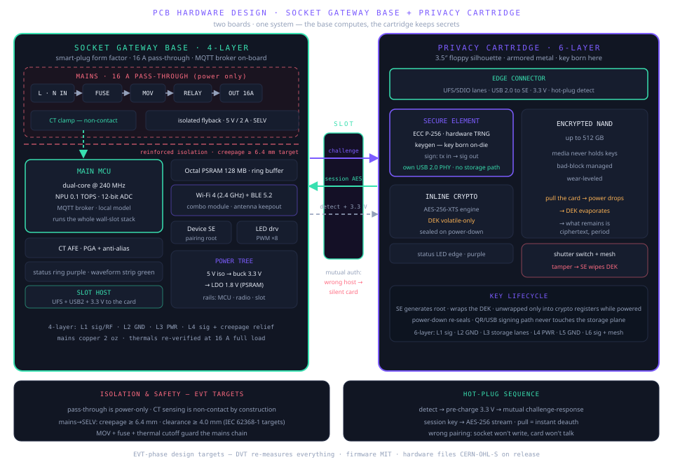
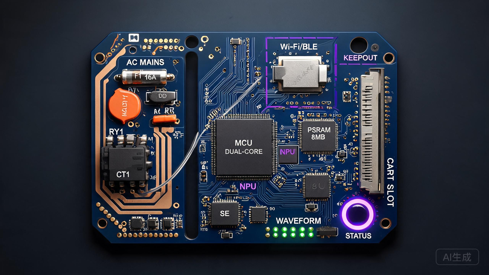
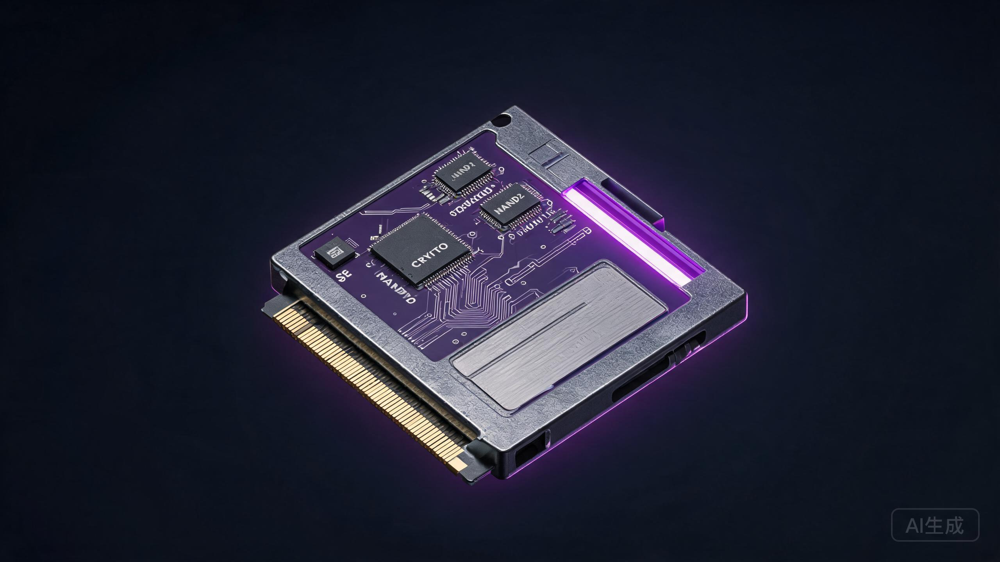
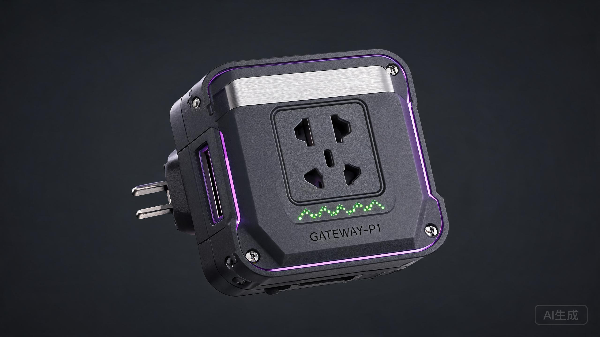
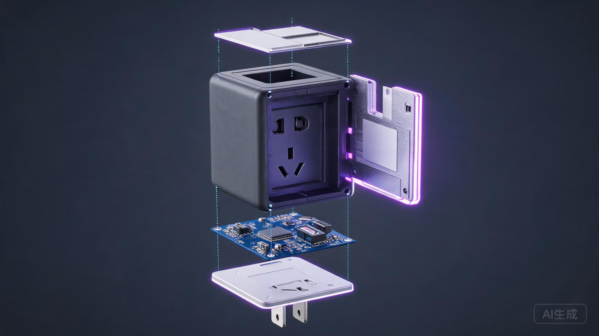

# PCB hardware design — socket gateway base + privacy cartridge

> EVT-phase design documentation. All values are design targets pending DVT
> measurement. Firmware is MIT; hardware design files will be released under
> CERN-OHL-S as they pass EVT.

Two boards, one system — the base computes, the cartridge keeps secrets:

<p align="center">
  
</p>

## 1. Board partitioning

| Board | Role | Layers | Form factor |
|---|---|---|---|
| Socket gateway base | Gateway + compute + current sensing + radio + slot host | 4 | Smart-plug, 16 A pass-through outlet |
| Privacy cartridge | Secure element + encrypted storage + cold wallet | 6 | 3.5″ floppy silhouette, armored metal |

The two boards mate through the side slot; the desktop and industrial
editions carry the same cartridge interface.

## 2. Design choices vs. the mainstream

### 2.1 The AI-hardware mainstream (2026)

The silicon picks follow what mainstream AI hardware already validated:

- **Main MCU — ESP32-S3 class.** Dual 240 MHz cores with vector extensions for
  NN inference, Wi-Fi 4 + BLE, external PSRAM — the current default for compact
  edge-AI devices (AI pendants, wearable consoles) precisely because it runs
  quantized models on-device. Our 0.1 TOPS-class NPU target sits on top of it
  for the anomaly-detection pipeline.
- **Local-first SLM tier.** The 2026 edge consensus: sub-4B quantized models
  (Q4-class) run on low-power NPUs, and memory bandwidth — not compute — is
  the first bottleneck. That is why the ring buffer is octal PSRAM on a wide
  bus rather than more NPU TOPS: the wall-slot workloads are streaming and
  feature-shaped, not generative-shaped.
- **Thread/Matter-ready radio plan.** BLE 5.2 today, Thread border-router
  profile reserved on the radio so the socket can join a Matter fabric later —
  2026 smart-home hardware is expected to carry both.
- **Privacy as the differentiator, not the compute.** Mainstream pendants
  process voice on-device and stop there; the Deck adds the physical cartridge
  pull — a privacy property made of metal, not policy.

### 2.2 Industrial-gateway discipline (Moxa / USR as reference)

The incumbent protocol-gateway vendors set the board-level reliability bar
the industrial edition is designed against. From Moxa's MGate line (the
MB3170-G2 Modbus gateway, the 5121-series CAN/J1939 units): 2 kV isolated
serial ports on the "-I" isolated models, −40 to 75 °C operating range, DIN
rail with conduction cooling and no fans, terminal-block wiring, EMC to
EN 61000-6-2/-6-4 with CISPR 32 Class A. USR IOT (Jinan) shows the budget
floor — non-isolated serials, plastic housings, 0–70 °C — at a fraction of the
price. What the Deck's industrial edition adopts from that discipline:

- **Isolated field transceivers** — 2 kV-class isolation on RS-485 and CAN,
  surge-clamped, referencing the MGate "-I" model tier
- **Wide-temp BOM** −40 to 75 °C on the DIN-rail edition, industrial
  electrolytics and derated ceramics
- **Hardware watchdog** — independent of the main MCU, power-cycles the relay
  state to safe if the agent stack hangs
- **Terminal blocks + DIN-rail conduction cooling**, no fan, no moving parts

What differs from both vendors: Moxa and USR gateways bridge protocols and
stop at the network — none carries an NPU, a secure element, or a removable
encrypted cartridge, and none gates device writes behind a human-pressed
button. The bridge discipline is borrowed; the privacy and permission
architecture is ours.

## 3. Socket gateway base PCB

<p align="center">
  
</p>

### 3.1 Mains section
- L/N pass-through: 16 A fuse → MOV → relay → outlet. Power path only.
- Current sensing: CT clamp over the line conductor — non-contact and
  galvanically isolated by construction; the 1 kHz sampled signature feeds
  start-spike / duty-cycle / running-current features.
- AC-DC: isolated flyback, 5 V / 2 A, reinforced insulation to SELV.

### 3.2 Logic section
- Main MCU: dual-core @ 240 MHz, vector/NPU assist, 12-bit ADC
- Sensing chain: CT → AFE (PGA + anti-alias) → ADC @ 1 kHz, 200 ms rolling
  feature windows
- Memory: 128 MB octal PSRAM ring buffer (store-and-forward for northbound
  outages)
- Radio: Wi-Fi 4 (2.4 GHz) + BLE 5.2 combo module, Thread profile reserved,
  antenna keepout at the board edge
- Device SE: ATECC608-class — holds the slot pairing root, so the base can
  verify a cartridge and be verified by it
- LEDs: status ring (purple) + current waveform strip (green), PWM-driven

### 3.3 Power tree

```
AC mains ──► isolated flyback 5 V / 2 A ──► buck 3.3 V ──► LDO 1.8 V
                                              │
              mains side: relay coil, zero-cross detector
                                              └─► MCU · radio · slot (3.3 V to card)
```

### 3.4 Stackup (4-layer)

| Layer | Function |
|---|---|
| L1 | Signal + RF keepout under the module antenna |
| L2 | Solid GND |
| L3 | Power islands (5 V / 3.3 V / 1.8 V) |
| L4 | Signal + creepage relief toward the mains region |

### 3.5 Mains safety (EVT targets)
- Pass-through is power-only — no logic trace crosses the mains region
- CT sensing is non-contact: no galvanic path from mains to logic
- Reinforced insulation mains→SELV: creepage ≥ 6.4 mm, clearance ≥ 4.0 mm
  (IEC 62368-1 targets)
- MOV + fuse + thermal cutoff as the primary protection chain
- 16 A track sizing on 2 oz outer copper; DVT re-verifies thermals at full
  load. Until certification is final, high-power resistive loads (space
  heaters) are out of the supported envelope.

## 4. Privacy cartridge PCB

<p align="center">
  
</p>

### 4.1 Two planes on one board
- **Wallet plane** — secure element with its own USB 2.0 PHY: transactions in,
  signatures out, the storage plane is never involved
- **Storage plane** — inline crypto engine + encrypted NAND, up to 512 GB

### 4.2 Secure element
- ECC P-256, hardware TRNG, key generation on-die
- The root key is born in the SE and never leaves in the clear
- Cold-wallet signing: tx in → SE signs → signed tx out — the network sees
  signatures, never keys

### 4.3 Storage encryption
- AES-256-XTS inline engine between host interface and NAND
- The data-encryption key (DEK) is generated in the SE, wrapped for transport,
  unwrapped only into the crypto engine's volatile registers while powered
- Power-down re-seals the DEK; the media never holds the key
- Pull the cartridge → power drops → DEK evaporates → the NAND is ciphertext

### 4.4 Edge connector
- Storage lanes: UFS/SDIO-class differential pairs
- Dedicated USB 2.0 pair to the SE only — signing works even with the
  storage plane quiescent
- 3.3 V power from the slot, hot-plug detect pin, pre-charge limits inrush

### 4.5 Tamper
- Metal shutter switch (the floppy shutter, alive again): open shutter during
  a session = tamper event
- Optional active mesh over the SE region — tamper → SE wipes the volatile DEK

### 4.6 Stackup (6-layer)

| Layer | Function |
|---|---|
| L1 | Signal — SE + crypto sideband |
| L2 | GND |
| L3 | High-speed storage lanes |
| L4 | Power |
| L5 | GND |
| L6 | Signal + tamper mesh |

## 5. The slot interface

Hot-plug sequence: **detect → pre-charge 3.3 V → mutual challenge-response →
session key (AES-256) → stream.**

Mutual, both directions: a cartridge that does not recognize the host stays
silent — not one byte leaves; a base that does not recognize the cartridge
refuses to write. Wrong pairing means no session, by construction.

## 6. Industrial renders (EVT concept)

The assembled device, industrial-grade exterior — matte dark-gray shell,
pass-through outlet, purple status ring, green current-waveform strip, side
slot for the cartridge:

<p align="center">
  
</p>

The full assembly — prong base, gateway PCB, rugged shell, the privacy
cartridge sliding into its side slot, metal shutter detail:

<p align="center">
  
</p>

Concept renders for the EVT phase; production tooling may differ.

## 7. EVT design targets

| Parameter | Target |
|---|---|
| Pass-through rating | 16 A / 250 V (certification-pending) |
| Current sampling | 1 kHz waveform, ±1% active power |
| Feature window | 200 ms rolling |
| MCU | dual-core @ 240 MHz + 0.1 TOPS-class NPU assist |
| Ring buffer | 128 MB octal PSRAM |
| Northbound | Wi-Fi 4 (2.4 GHz), mDNS discovery, TLS 1.3 |
| Near-field | BLE 5.2 (Thread profile reserved) |
| Cartridge capacity | up to 512 GB, AES-256-XTS |
| Slot session | mutual auth, AES-256, hot-plug, instant deauth on pull |
| Isolation | mains→SELV creepage ≥ 6.4 mm / clearance ≥ 4.0 mm |

## 8. Status

Design-stage hardware; EVT target specs. Firmware is open source (MIT);
schematics and layout files will be published under CERN-OHL-S once EVT units
are validated. This document describes the integration architecture — it is
not a certification document, and all safety values are targets until DVT
measurement and third-party testing.

Independent community project — not affiliated with, endorsed by, or
sponsored by Andrew Ng, deeplearning.ai, or the OpenWorker project.
